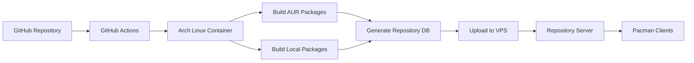

# Manjaro Package Builder


Automated CI/CD pipeline for building and managing Arch/Manjaro packages with GitHub Actions.

## 🚀 Features

- **Automated Package Building**: Build both AUR packages and custom local packages
- **Repository Management**: Create and maintain Arch Linux package repositories
- **Version Synchronization**: Automatically update PKGBUILDs to match built versions
- **Network Diagnostics**: Comprehensive connectivity testing
- **Retry Logic**: Robust error handling with automatic retries
- **GitHub Actions Integration**: Fully automated workflow

## 📋 Quick Start

### 1. Clone and Configure

```bash
git clone https://github.com/yourusername/manjaro-package-builder.git
cd manjaro-package-builder
```

### 2. Set Up GitHub Secrets

Add these secrets to your GitHub repository:

| Secret | Description |
|--------|-------------|
| `VPS_USER` | SSH username for your VPS |
| `VPS_HOST` | Hostname/IP of your VPS |
| `VPS_SSH_KEY` | Private SSH key (base64 encoded) |
| `REPO_SERVER_URL` | Repository URL (e.g., https://example.com/repo) |
| `REMOTE_DIR` | Remote directory path (e.g., /var/www/repo) |

### 3. Configure Your Packages

Edit `scripts/packages.py`:

```python
LOCAL_PACKAGES = [
    "your-package-1",
    "your-package-2",
]

AUR_PACKAGES = [
    "libinput-gestures",
    "betterlockscreen",
]
```

### 4. Run the Workflow

Go to your GitHub repository → Actions → "MPB - with diagnostic" → Run workflow

## 🏗️ Architecture



## 📁 Project Structure

```
.
├── .github/workflows/          # GitHub Actions workflows
├── scripts/                    # Python builder scripts
│   ├── builder.py             # Main orchestrator
│   ├── config.py              # Configuration
│   └── packages.py            # Package definitions
├── examples/                   # Example PKGBUILDs
├── README.md                  # This file
└── LICENSE                    # MIT License
```

## 🔧 Configuration

### config.py
```python
REPO_DB_NAME = "manjaro-awesome"
SPECIAL_DEPENDENCIES = {
    "gtk2": ["gtk-doc", "docbook-xsl"],
    "awesome-git": ["lua", "lgi", "imagemagick"],
}
```

### packages.py
```python
LOCAL_PACKAGES = ["awesome-git", "gtk2"]
AUR_PACKAGES = ["libinput-gestures", "simplescreenrecorder"]
```

## 🚨 Troubleshooting

### Common Issues

1. **SSH Connection Failures**
   ```bash
   # Check fail2ban on VPS
   sudo fail2ban-client status sshd
   sudo fail2ban-client set sshd unban <IP>
   ```

2. **Package Build Failures**
   - Check GitHub Actions logs
   - Examine `builder.log` artifact
   - Verify dependencies in PKGBUILD

3. **Repository Database Issues**
   ```bash
   # On VPS:
   cd /var/www/your_repo
   rm your-repo.*
   # Rerun workflow
   ```

## 📊 Workflow

The workflow runs daily at 4 AM UTC or can be triggered manually:

1. **Environment Setup** - Prepare Arch Linux container
2. **PKGBUILD Fixes** - Handle versioning issues
3. **SSH Configuration** - Set up VPS connection
4. **Package Building** - Build AUR and local packages
5. **Database Generation** - Create repository databases
6. **Upload** - Transfer packages to VPS
7. **Cleanup** - Remove old package versions
8. **PKGBUILD Sync** - Update version numbers in git

## 🤝 Contributing

Contributions are welcome! Please read our [Contributing Guide](CONTRIBUTING.md).

## 📄 License

This project is licensed under the MIT License - see the [LICENSE](LICENSE) file for details.

## 🙏 Acknowledgments

- Arch Linux and Manjaro communities
- GitHub Actions team
- All contributors and users

---

⭐ **If you find this project useful, please give it a star!** ⭐
